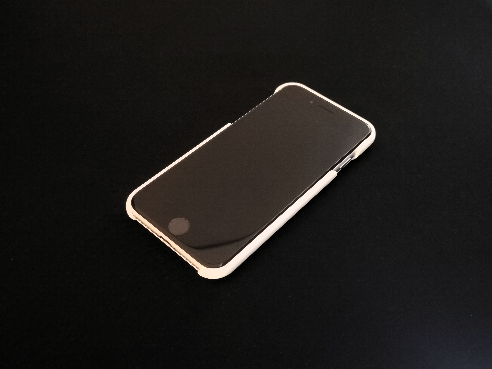
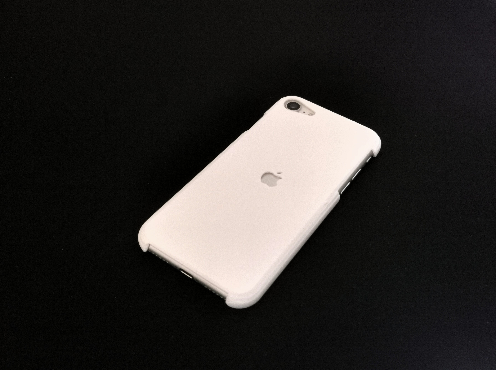

# iphone-se-2nd-3rd-gen-case 📱
Minimalist phone case design for iPhone SE (2nd &amp; 3rd Gen). For anyone else clinging to this vintage device, I've got you covered - literally.

The design is optimized for 3D printing in PLA filament. The below was printed on a Bambulab A1 Mini using default settings.

 [See the Fusion 360 interactive preview here.](https://a360.co/420a5SC)

## Files Included 📁
- **[case.stl](case.stl)**: 3D-printable file (preview available on GitHub).
- **[case.f3z](case.f3z)**: Original Fusion 360 file, complete with parametric design history.
- **[case.step](case.step)**: Universal CAD file for cross-platform editing.

## Usage Instructions ⚙️
- **3D Printing Enthusiasts:** Download `case.stl` and use slicer software to prepare for printing.
- **Fusion 360 Users:** Download `case.f3z` for full parametric editing.
- **CAD Professionals:** Download `case.step` to edit the design in your preferred CAD software.

## License 📄
This project is licensed under the MIT License. See the [LICENSE](LICENSE) file for more details.

